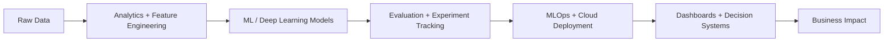

<div align="center">


[](https://git.io/typing-svg)

<p>
  <a href="mailto:saideepaksharma8@gmail.com">
    
  </a>
  <a href="https://www.linkedin.com/in/sai-deepak-sharma-09518b210/">
    
  </a>
  <a href="https://github.com/deepaksharma0801">
    
  </a>
</p>


</div>

---

## Data Scientist Building AI Systems That Move From Notebook To Production

I am a Master's student in **Data Science, Computing & Decision Analytics at Arizona State University** with a **3.8/4.0 GPA**, focused on **Agentic AI, Machine Learning, Generative AI, MLOps, and Data Analytics**.

My work sits at the intersection of predictive modeling, decision intelligence, and deployable AI products. I enjoy building systems that can reason over data, automate decisions, improve operations, and create measurable business impact.

<br/>

<table>
  <tr>
    <td width="33%" align="center">
      
      <br/><sub>Workflow automation at ASU Knowledge Enterprise</sub>
    </td>
    <td width="33%" align="center">
      
      <br/><sub>AI-based enterprise intent recognition</sub>
    </td>
    <td width="33%" align="center">
      
      <br/><sub>Scalable ML pipeline processing</sub>
    </td>
  </tr>
</table>

---

## Current Signal

```txt
Role        MS Data Science student at Arizona State University
Focus       Agentic AI, Generative AI, ML systems, analytics engineering
Strengths   Predictive modeling, computer vision, NLP, BI dashboards, cloud ML
Mindset     Build measurable AI products, not just experiments
```



---

## Technical Arsenal

<div align="center">

### Programming & Core


### AI, Machine Learning & GenAI


### Data Engineering & Analytics


### MLOps, DevOps & Cloud


</div>

---

## Experience Highlights

<table>
  <tr>
    <td width="50%">
      <h3>Strategic Marketing Analyst</h3>
      <strong>ASU Knowledge Enterprise</strong>
      <br/><br/>
      <ul>
        <li>Automated marketing workflows, reducing manual effort by <strong>40%</strong>.</li>
        <li>Built predictive regression models with a <strong>25%</strong> accuracy improvement.</li>
        <li>Led A/B testing across <strong>40+</strong> campaigns, increasing ROI by <strong>17%</strong>.</li>
        <li>Integrated <strong>20+</strong> data sources into BI dashboards.</li>
      </ul>
    </td>
    <td width="50%">
      <h3>Gen AI & ML Intern</h3>
      <strong>Wipro</strong>
      <br/><br/>
      <ul>
        <li>Built an AI-based intent recognition system with <strong>89%</strong> classification accuracy.</li>
        <li>Designed scalable ML pipelines processing <strong>100K+</strong> records per month.</li>
        <li>Improved enterprise workflow efficiency by <strong>25%</strong>.</li>
        <li>Worked across model development, evaluation, and deployment workflows.</li>
      </ul>
    </td>
  </tr>
</table>

---

## Research & Applied AI

| Area | Work | Outcome |
|---|---|---|
| Computer Vision | CNN-SVM hybrid modeling | 18% accuracy improvement |
| Cloud Optimization | Metaheuristic task scheduling | 22% makespan reduction |
| Model Optimization | Inference pipeline refinement | 15% latency reduction |
| Decision Analytics | Predictive modeling and BI dashboards | Faster campaign and operations insight |

---

## AI Product Builder Map

<table>
  <tr>
    <td width="25%"><strong>Agentic AI</strong><br/>Tool use, workflow automation, reasoning systems, AI copilots</td>
    <td width="25%"><strong>Predictive ML</strong><br/>Regression, classification, experimentation, optimization</td>
    <td width="25%"><strong>Computer Vision</strong><br/>CNNs, OpenCV, hybrid model design, inference tuning</td>
    <td width="25%"><strong>Analytics</strong><br/>Dashboards, KPI tracking, BI pipelines, A/B testing</td>
  </tr>
</table>

---

## GitHub Intelligence Dashboard

<div align="center">


<br/>


<br/>


<br/>


</div>

---

## Contribution Graph

<div align="center">


</div>

---

## What I Am Building Toward

```txt
01. Agentic AI systems that connect LLM reasoning with real business workflows
02. Predictive analytics products that help teams make faster decisions
03. Scalable ML pipelines with monitoring, reproducibility, and cloud deployment
04. Data-rich dashboards that translate model output into operational clarity
```

---

## Let's Connect

I am always open to conversations around AI products, ML engineering, data science internships, research collaborations, and applied decision systems.

<div align="center">

<a href="mailto:saideepaksharma8@gmail.com">
  
</a>
<a href="https://www.linkedin.com/in/sai-deepak-sharma-09518b210/">
  
</a>

</div>


